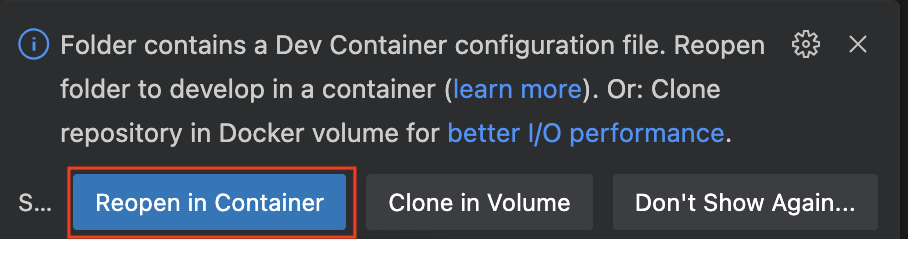
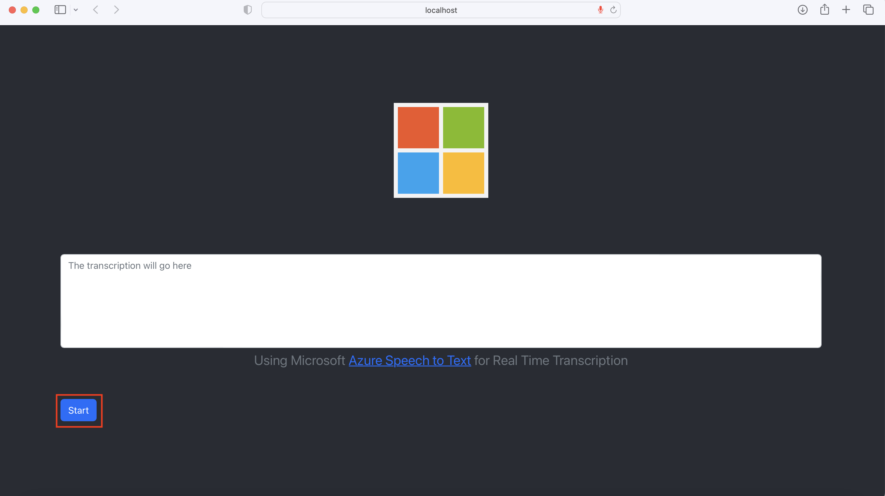

# Real Time Transcription - Simple

This repo contains a fully working web-based Real Time Transcription application, powered by Azure Speech to Text. You can deploy it to your Azure subscription and local PC in less than 20 minutes. You can then modify it for your specific needs.

It is part 1 of a series of repos on how to build real-time-transcription applications using Azure Speech to Text.

Once you deploy this application, you will have something like this:

<video src="https://user-images.githubusercontent.com/5172249/220519456-64b79988-3b04-4124-a358-9b3fbfd5b044.mov" width=800 autoplay="autoplay>

This post is the number 1 post of a series of posts, demonstrating Azure Speech to Text in real-time, in scenarios that are increasingly more complex. This scenario is the simplest of them all: real-time transcription of spoken work in English, using the standard Azure model.

## The Technology Used

You will be using: 

* **Azure Speech-to-Text**
* **React.js** with Javascript (with Bootstrap, to make things look good)
* **Devcontainers** - You can use this repo on your PC/MAC or on Codespaces in Github. This makes it easy for you to develop without having to install Node, NPM, or the React modules you will need

By following the steps under [Installation](#installation) you wil be able to get started quickly

## Architecture

The architecture is shown below:


## Getting Started


### Prerequisites

This repository is used to build the application on a personal computer or on GitHub Codespaces. It uses [Devcontainers](https://code.visualstudio.com/docs/devcontainers/containers).

You need to have the following on your personal computer (PC, Mac or Linux):

* Visual Studio Code - you can install it from here: https://code.visualstudio.com/Download
* Docker Desktop - you can install it from here: https://docs.docker.com/desktop/
* Git - you can install it from here: https://git-scm.com/book/en/v2/Getting-Started-Installing-Git

**NB ->** Alternatively, you can run this application entirely in a [codespace](https://docs.github.com/en/codespaces/overview). 

### Installation

#### Azure Services

The first step is to enable the required **Azure Cognitive Services**. To do that: 

* Click the button bellow:

[](https://portal.azure.com/#create/Microsoft.Template/uri/https%3A%2F%2Fraw.githubusercontent.com%2FRenSilvaAU%2Farm-templates%2Fmain%2F.arm%2FCognitiveServices%2Ftemplate.json)

Once you have the prerequisites met:

* Clone the repository
* Open it with Visual Studio Code. 

You will get a screen like this:



* Click **Reopen in Container** to open the Devcontainer. Node, yarn, etc. are installed on it, and that is all you need to build and run your webapp.


## Run Webapp

### Add your secrets

This only needs to be done once.

* Create the .env file. On your Visual Studio code terminal, enter

```
cd webapp 
cp env-template .env
```

* update the file, entering the credentials for your recently created Azure Cognitive Services:

```
REACT_APP_COG_SERVICE_KEY=<your congnitive service key>
REACT_APP_COG_SERVICE_LOCATION=<your cognitive service region>
```

### Run the app

* On the terminal enter:

```
cd webapp
yarn start
```

You will have a response like this on Visual Studio Code:


* Click **Open in Browser**

And, after some time you will see the app on the browser:



* click **start** and start speaking English. 

It will start transcribing what you say:


* Click **stop** to stop transcribing.


* Click **export** to download the transcription.

## Under the Hood

This solution demonstrates the use of **Azure Speech to Text**'s Continuous Recognition, using the Javascript SDK.

It follows the instructions provided in this [Azure Speech to Text - Use continuous recognition](https://learn.microsoft.com/en-us/azure/cognitive-services/speech-service/how-to-recognize-speech?pivots=programming-language-javascript#use-continuous-recognition)

The "magic" happens in this part of the code: [/webapp/src/Components/Transcription.js](/webapp/src/Components/Transcription.js)

First, we define a speech configuration with code like this:

```
const speechConfig = sdk.SpeechConfig.fromSubscription("YourSpeechKey", "YourSpeechRegion");
```

In order to capture the computer microphone, we use media services. This is done when the website is first rendered, via this code:

```
const getMedia = async (constraints) => {
  let stream = null
  try {
    stream = await navigator.mediaDevices.getUserMedia(constraints)
    // stream is then passed to the recognizer
  } catch (err) {
    /* handle the error */
    alert(err)
    console.log(err)
  }
}
```

We define the audio configuration, to read the stream, using the stream defined above:

This is done with code like this:

```
// configure Azure STT to listen to an audio Stream
const audioConfig = AudioConfig.fromStreamInput(stream)
```

Then we put it all together in one recognizer:

```
const recognizer = new sdk.SpeechRecognizer(speechConfig, audioConfig);
```

And create callbacks for when continuous recognition is running:

```
recognizer.recognizing = (s, e) => {

  // uncomment to debug
  // console.log(`RECOGNIZING: Text=${e.result.text}`)
  setRecognisingText(e.result.text)
  textRef.current.scrollTop = textRef.current.scrollHeight
}

recognizer.recognized = (s, e) => {
  setRecognisingText("")
  if (e.result.reason === sdk.ResultReason.RecognizedSpeech) {

    // uncomment to debug
    // console.log(`RECOGNIZED: Text=${e.result.text}`)

    setRecognisedText((recognisedText) => {
      if (recognisedText === '') {
        return `${e.result.text} `
      }
      else {
        return `${recognisedText}${e.result.text} `
      }
    })
    textRef.current.scrollTop = textRef.current.scrollHeight
  }
  else if (e.result.reason === sdk.ResultReason.NoMatch) {
    console.log("NOMATCH: Speech could not be recognized.")
  }
}

recognizer.canceled = (s, e) => {
  console.log(`CANCELED: Reason=${e.reason}`)

  if (e.reason === sdk.CancellationReason.Error) {
    console.log(`"CANCELED: ErrorCode=${e.errorCode}`)
    console.log(`"CANCELED: ErrorDetails=${e.errorDetails}`)
    console.log("CANCELED: Did you set the speech resource key and region values?")
  }
  recognizer.stopContinuousRecognitionAsync()
}

recognizer.sessionStopped = (s, e) => {
  console.log("\n    Session stopped event.")
  recognizer.stopContinuousRecognitionAsync()
}
```

Then, whenever we want the recognizer to run, we run:

```
recognizer.startContinuousRecognitionAsync()
```

And, to stop it we run:

```
recognizer.stopContinuousRecognitionAsync()
```

The entire code of this solution is here: [/webapp/src/Components/Transcription.js](/webapp/src/Components/Transcription.js)

## Conclusion

This is the quick and simple way to build a working real-time-transcription webapp using React and javascript. This webapp recognizes English only, and simply transcribes what was said. It uses the standard model, so, some industry or subject specific words may be missed.

Next, you will learn how to recognize other languages, and how to improve accuracy by providing extra vocabulary.


