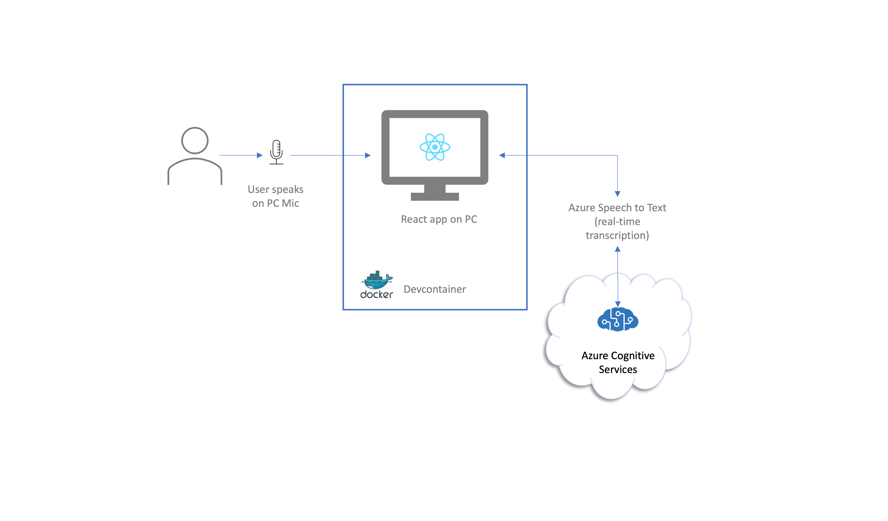

# Real Time Transcription - Simple

This repository contains a web-based Real Time Transcription application using Azure Speech to Text, running on a web browser, that you can deploy in less than 1/2 hour. 

You can then fork the application and modify for your needs.


This post is the number 1 post of a series of posts, demonstrating Azure Speech to Text in real-time, in scenarios that are increasingly more complex. This scenario is the simplest of them all: real-time transcription or spoken work in English, using the standard Azure model.

## The Technology Used

You will be using: 

* **Azure Speech-to-Text**
* **React.js** with Javascript (with Bootstrap, to make things look good)
* **Devcontainers** - You can use this repo on your PC/MAC or on Codespaces in Github. This makes it easy for you to develop without having to install Node, NPM, or the React modules you will need

By following the steps under [Installation](#installation) you wil be able to get started quickly

## Architecture

The architecture is shown below:




## Getting Started


### Prerequisites

This repository is used to build the application on a personal computer or on GitHub Codespaces. It uses a [Devcontainers](https://code.visualstudio.com/docs/devcontainers/containers).

You need to have the following on your personal computer (PC, Mac or Linux):

* Visual Studio Code - you can install it from here: https://code.visualstudio.com/Download
* Docker Desktop - you can install it from here: https://docs.docker.com/desktop/
* Git - you can install it from here: https://git-scm.com/book/en/v2/Getting-Started-Installing-Git

**NB ->** Alternative, you can run this application entirely on a [codespace](https://docs.github.com/en/codespaces/overview). 

### Installation

#### Azure Services

The first step is to enable the required **Azure Cognitive Services**. To do that: 

* Click the button bellow:

[](https://portal.azure.com/#create/Microsoft.Template/uri/https%3A%2F%2Fraw.githubusercontent.com%2FAzure-Samples%2Freal-time-transcription-simple%2Fmain%2F.arm%2FCognitiveServices%2Ftemplate.json%3Ftoken%3DGHSAT0AAAAAAB47JS5E5ZU636XJRJR6KB2IY7JZORA)

Once you have the prerequisites met:

* Clone the repository
* Open it with Visual Studio Code. 

You will get a screen like this:


* Click **Reopen in Container** to open the Devcontainer. Node, yarn, etc. are installed on it, and that is all you need to build and run your webapp.


## Run Webapp

### Add your secrets

This only needs to be done once.

* Create the .env file. On your Visual Studio code terminal, enter

```
cd webapp 
cp env-template .env
```

* update the file, entering the credentials for your recently created Azure Cognitive Services:

```
REACT_APP_COG_SERVICE_KEY=<your congnitive service key>
REACT_APP_COG_SERVICE_LOCATION=<your cognitive service region>
```

### Run the app

* On the terminal enter:

```
cd webapp
yarn start
```

You will have a response like this on Visual Studio Code:


* Click **Open in Browser**

And you will be the app:


* click **start** and start speaking English. 

It will start transcribing what you say:


* Click **stop** to stop transcribing.


* Click **export** to download the transcription.


